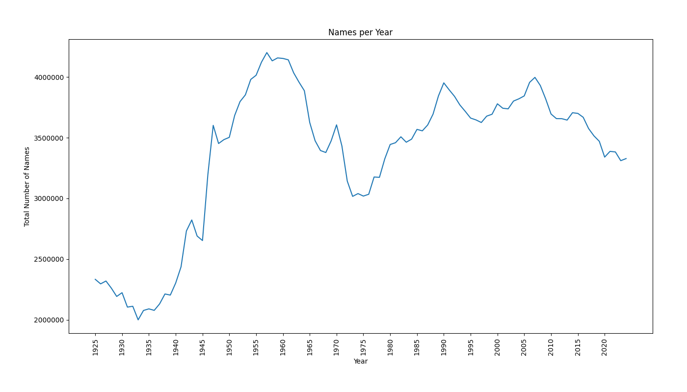
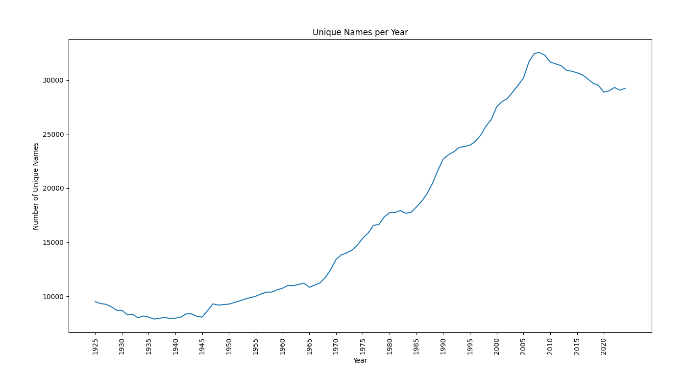
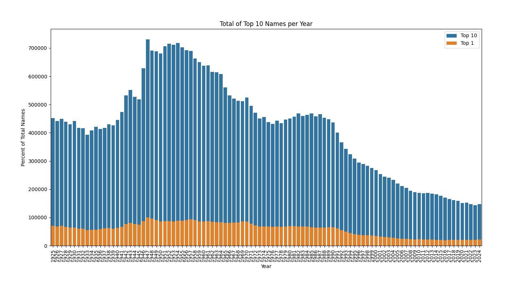
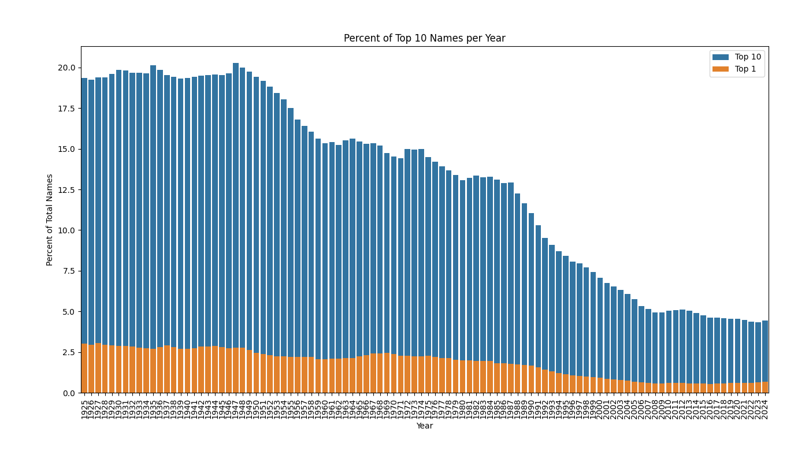
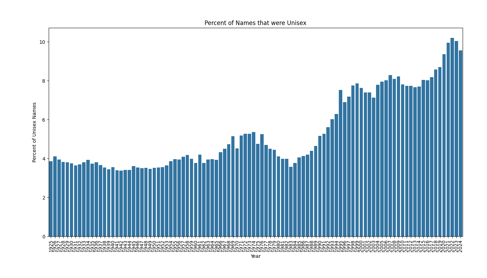
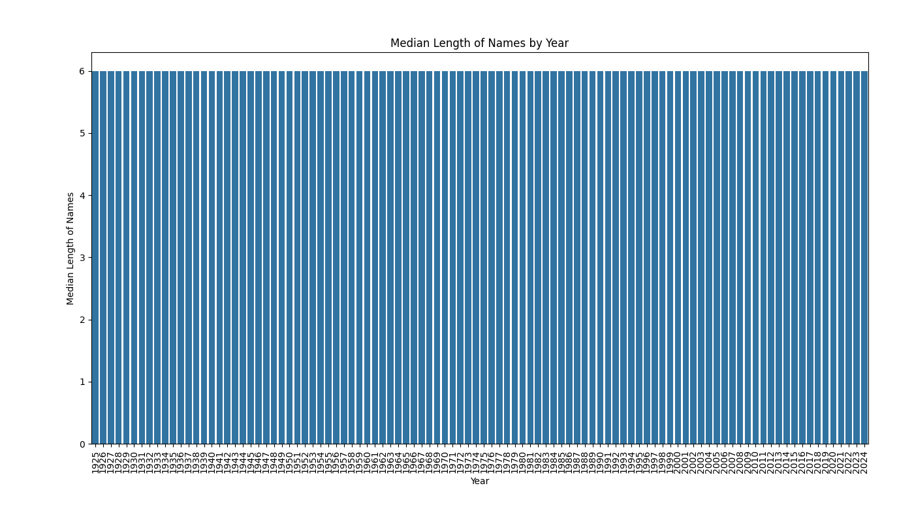
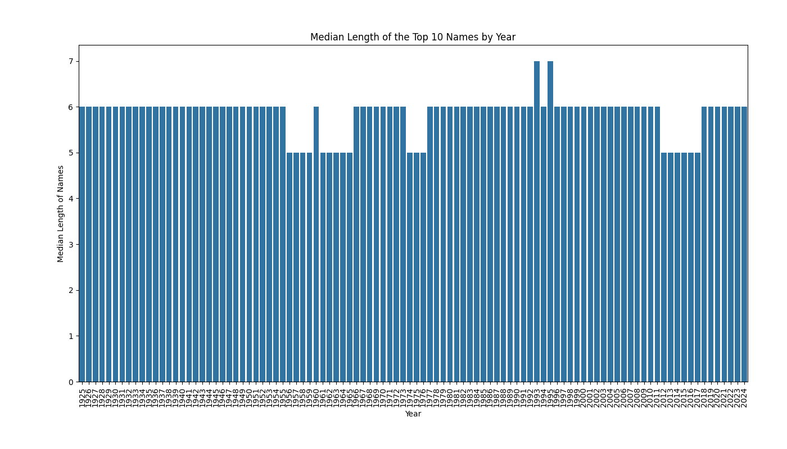

# Baby Name Trends Analysis

An exploration of U.S. baby naming patterns over time, using historical datasets.  

## Overview
This project analyzes trends in baby names over the last 100 years.  
Key questions:
- Are parents choosing from a larger pool of names today than in the past?
- How is the popularity of the top 10 names changing each year?
- How has the usage of unisex names changed over time?
- Are names getting longer or shorter over the decades?

## Preparing Data
The dataset comes from the U.S. Social Security Administration baby names files (yobYYYY.txt).
Each file contains all registered baby names for a given year, split by gender, along with the number of babies given that name.

Steps taken to prepare the data:
- Load raw files – All yearly text files (yobYYYY.txt) were read in using pandas and glob.
- Add year column – The year was extracted from each filename and stored as 'yob'.
- Combine into one dataset – All yearly data was concatenated into a single DataFrame 'names_df'.
- Quality checks – Verified there were no missing values or duplicate rows.
- Save processed file – Exported the cleaned dataset to names_processed.csv for later analysis.

## Findings
### Names per Year
When looking at the total number of babies recorded each year, the counts fluctuate but overall show growth.  
- Compared to 50 years ago, total births have increased by about **10%**.  
- Compared to 100 years ago, they’ve risen by about **42%**. 

When we shift focus from total births to the number of **unique names** (the total variety of different names given each year), a trend emerges:  
- Over the past 50 years, the number of unique names has grown by about **89%**.  
- Over the past 100 years, that growth is an impressive **207%**.
There is a small dip in the last 15 years, but the overall long-term trend shows that parents are drawing from a **much wider pool of names** than in the past.

While the total number of names only grew by 42% in 100 years, the variety of names grew by over 200%. This points to a strong cultural shift: parents today are far more likely to choose unique, less common names for their children, leading to the larger name pool.

### Popularity of Top 10 and Top 1 Names
Here's a graph showing the total number of the top 10 most popular names each year. Even with the total number of names rising over the last 100 years, as mentioned, the total number of the top 10 names, while having an increase around 1947 and 1982, has trended downward.

Seen more clearly when looking at the percent of the top 10 names compared to the total population. The trend is more consistent, seeing the previous increase most likely due to a rise in population and not to an increase in name popularity. You can also see a similar trend in the number 1 most popular name each year.

With the top 10 names going from 19.3% of the total population in 1925 down to 4.4% in 2024, there isnt just a case of the popluar names being over run by the new names, but the popular names are less popular.

### Usage of Unisex Names
Next, we look at unisex names. Names that are given to both boys and girls, with at least 15% of babies of each gender.  

Over the past 100 years, there has been a gradual increase in the use of unisex names, rising by about 5.7%.  

Interestingly, while the total number of names and the variety of names increased over most of the century, the last 15 years show a slight decrease in variety. During the same period, the use of unisex names continued to rise, suggesting a cultural trend toward gender-neutral naming.

### Average Length of Names
Lastly, we look at the median length of the names each year. When looking at all names, each year the median is 6 across the board.

When looking at the median of only the top 10 most popular names each year, there are some years where it is 5 and some where it is 7 but mostly remains 6 with no trends leading to shorter or longer names over the last 100 years.

## Tools Used
- **Python**: data processing and analysis  
- **Pandas**: grouping, aggregations  
- **Seaborn & Matplotlib**: visualizations 
